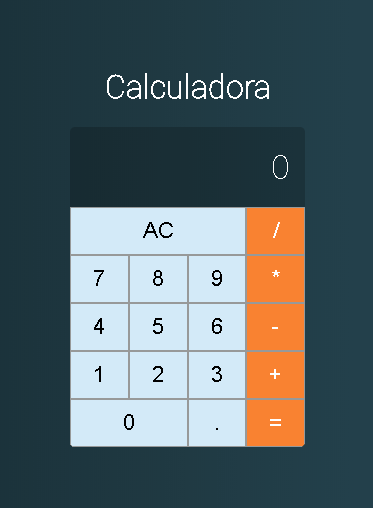

<h1 align="center">
    
</h1>

<h4 align="center">
  🚀 Calculadora
</h4>

<p align="center">
<a href="#-projeto">Projeto</a>&nbsp;&nbsp;&nbsp;|&nbsp;&nbsp;&nbsp;
  <a href="#rocket-tecnologias">Tecnologias</a>&nbsp;&nbsp;&nbsp;|&nbsp;&nbsp;&nbsp;  
  <a href="#-layout">Layout</a>&nbsp;&nbsp;&nbsp;|&nbsp;&nbsp;&nbsp;
  <a href="#zap-executando">Executando</a>&nbsp;&nbsp;&nbsp;
</p>

<br>

## 💻 Projeto

Calculadora desenvolvida com intuito de fixação de conceitos e lógica em javascript.

<div align="center">
  
  
</div>

## 🚀 Tecnologias

Esse projeto foi desenvolvido com as seguintes tecnologias:

- [React](https://reactjs.org)


## :zap: Como usar

Para executar essa aplicação


1 - Em um terminal, entrar na raiz do projeto **/calculadora** e rodar o comando:

```
$ npm i
```

2 - Ainda na raiz do projeto, rodar o comando:

```
$ npm start
```

Feito isso, abrirá seu navegador na porta http://localhost:3000

---

Made with ♥ by Raul Franck :wave: [Get in touch!](https://www.linkedin.com/in/raul-franck-468617164/)
